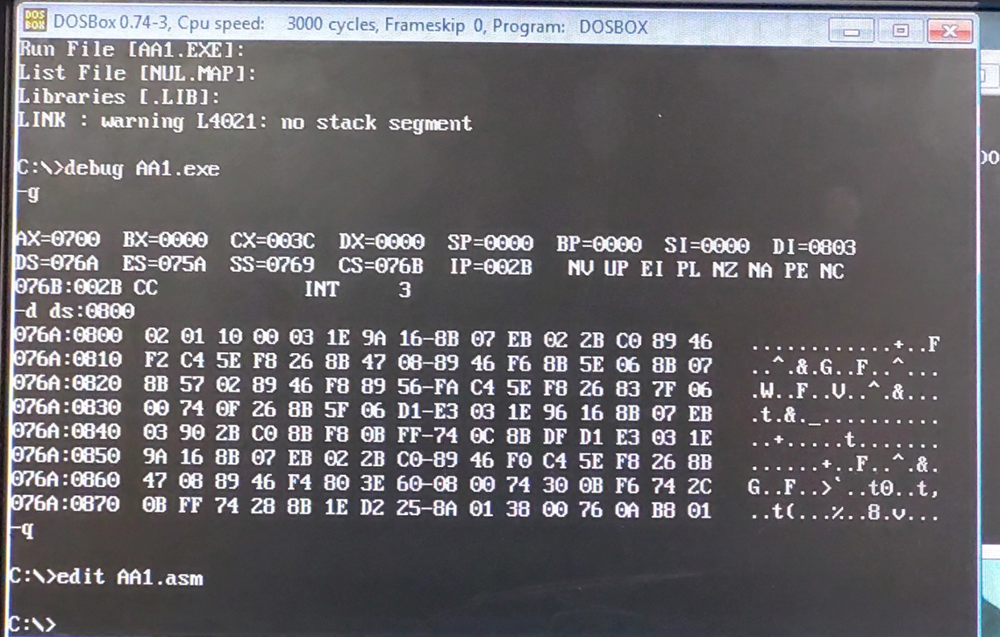
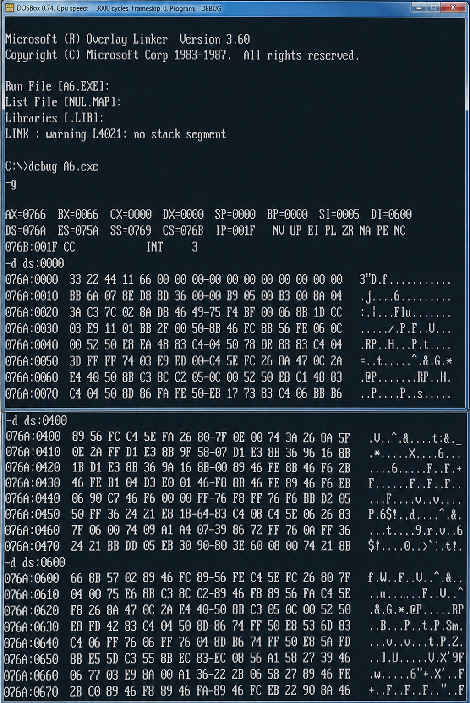
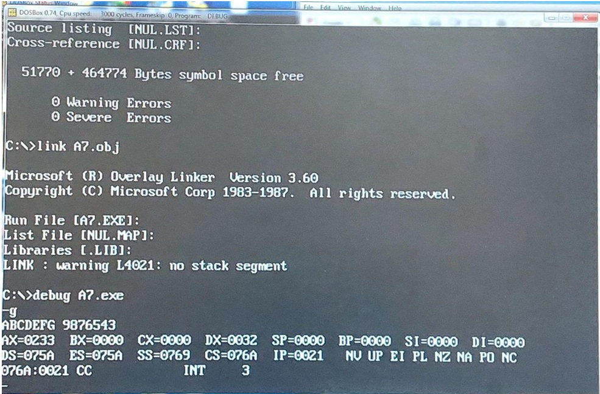
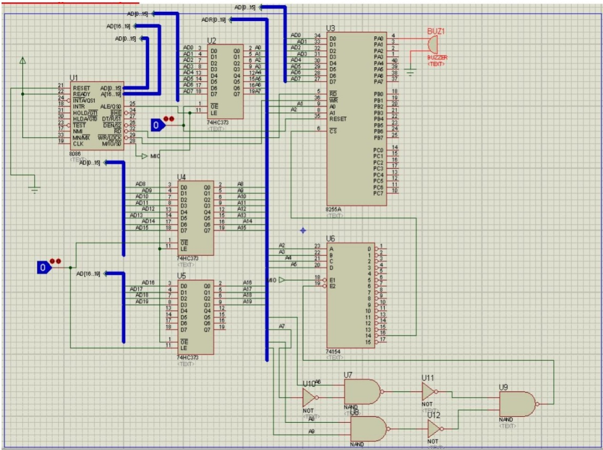
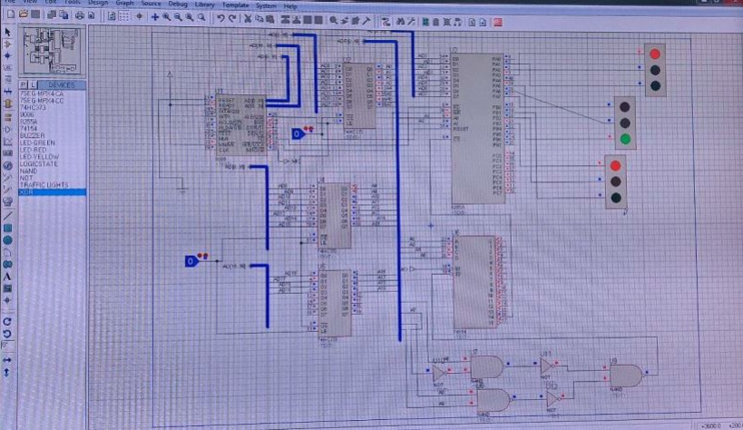
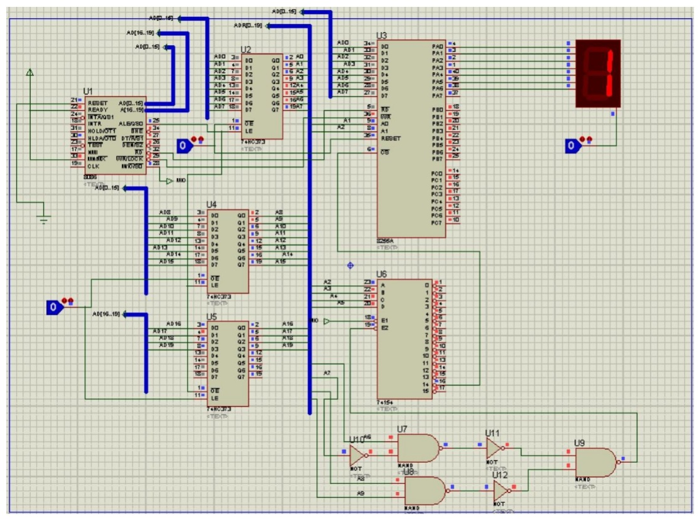
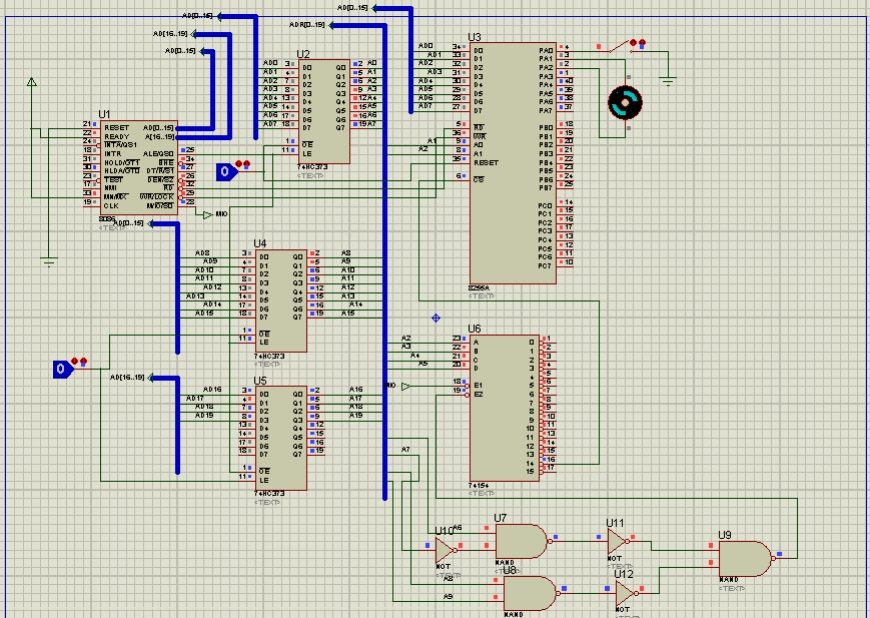
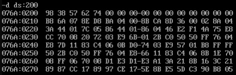
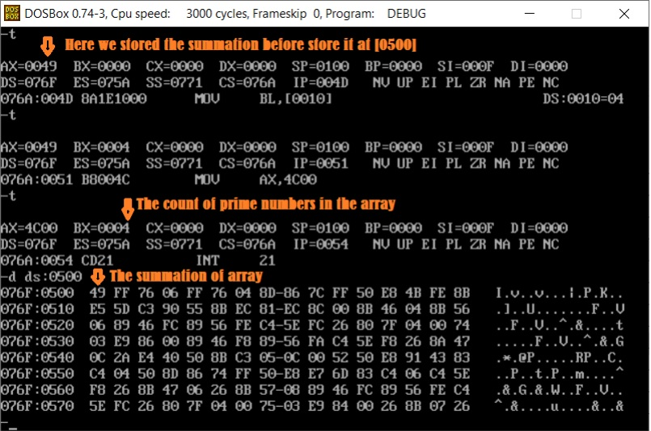

<h1 align="center">8086 Assembly Programming</h1>

  
  
  
  
  

  <strong>Practical Intel 8086 Assembly programs demonstrating low-level programming, algorithms, memory management, and hardware interfacing.</strong>

This repository showcases a series of Intel 8086 Assembly programs developed to demonstrate practical low-level programming techniques and hardware interfacing using Intel 8086 Assembly language. The implementations include arithmetic operations, array and string processing, sorting algorithms, prime number analysis, and hardware interfacing applications such as buzzer control, traffic light simulation, seven-segment displays, and DC motor control. Each program includes the complete Assembly source code and its corresponding execution output.

---

## Quick Navigation

**Overview** • **Implemented Programs** • **Skills Demonstrated** • **License**

---
## Overview

This repository presents a collection of practical Intel 8086 Assembly programs developed to strengthen low-level programming skills through real-world implementations. The projects cover a wide range of topics, including arithmetic operations, array and string processing, sorting algorithms, prime number analysis, and hardware interfacing.

In addition to software-oriented algorithms, the repository demonstrates direct interaction with peripheral devices such as buzzers, traffic light systems, seven-segment displays, and DC motors using Intel 8086 Assembly language. Each implementation is organized as an individual program with its corresponding source code and execution output, providing clear examples of Assembly programming techniques and hardware control.

## Implemented Programs

The following programs demonstrate a range of Intel 8086 Assembly programming concepts, from arithmetic and data processing to hardware interfacing and algorithm implementation. Each program includes its complete Assembly source code together with its corresponding execution output.
| Program | Description | Source Code | Output |
|---------|-------------|:-----------:|:------:|
| **Arithmetic Operations** | Performs addition and subtraction on two 8-bit hexadecimal numbers and stores the resulting values together with the carry and borrow flags in memory. This program demonstrates arithmetic instructions, flag handling, register operations, and direct memory access in Intel 8086 Assembly. | [View Code](01-arithmetic/arithmetic.asm) |  |
| **Array Processing** | Traverses an array of hexadecimal values to identify the largest element and stores the result in memory. This program demonstrates array traversal, indexed memory access, comparison instructions, conditional branching, and iterative processing in Intel 8086 Assembly. | [View Code](02-array-processing/array-processing.asm) |  |
| **String Processing** | Displays uppercase alphabetic and numeric character sequences using ASCII encoding and DOS interrupt services. This program demonstrates string manipulation, character encoding, loop control, and interrupt-driven output in Intel 8086 Assembly. | [View Code](03-string-processing/string-processing.asm) |  |
| **Buzzer Control** | Controls a buzzer through Intel 8086 output ports by generating ON/OFF signals with programmable software delays. This program demonstrates digital I/O programming, port communication, delay routines, subroutines, and hardware interfacing in Intel 8086 Assembly. | [View Code](04-buzzer-control/buzzer.asm) |  |
| **Traffic Light Control** | Simulates a traffic light warning mode by continuously blinking the yellow lights using programmable timing delays and digital output control. This program demonstrates hardware interfacing, port-based output, timing routines, loop control, and real-time embedded programming in Intel 8086 Assembly. | [View Code](05-traffic-light/traffic-light.asm) |  |
| **Seven-Segment Display** | Implements a decimal counter that sequentially displays digits from 0 to 9 on a seven-segment display using predefined segment patterns. This program demonstrates display interfacing, lookup tables, indexed memory access, timing routines, and digital output programming in Intel 8086 Assembly. | [View Code](06-seven-segment/seven-segment.asm) |  |
| **DC Motor Control** | Controls the rotational direction of a DC motor by reading switch inputs and sending control signals through Intel 8086 I/O ports. This program demonstrates digital input/output programming, port communication, conditional branching, and hardware interfacing in Intel 8086 Assembly. | [View Code](07-dc-motor/dc-motor.asm) |  |
| **Bubble Sort** | Sorts an array of hexadecimal values in ascending order using the Bubble Sort algorithm. This program demonstrates array manipulation, nested loops, comparison instructions, element swapping, and algorithm implementation in Intel 8086 Assembly. | [View Code](08-bubble-sort/bubble-sort.asm) |  |
| **Prime Number Analysis** | Analyzes an array of hexadecimal values by calculating the total sum, identifying prime numbers, counting their occurrences, and storing the computed results in memory. This program demonstrates array traversal, arithmetic operations, nested loops, division, conditional branching, memory management, and algorithm implementation in Intel 8086 Assembly. | [View Code](09-prime-number-analysis/prime-analysis.asm) |  |

## Skills Demonstrated

- Intel 8086 Assembly Programming
- Low-Level Software Development
- Arithmetic and Logical Operations
- Register and Memory Manipulation
- Array Traversal and Data Processing
- String and ASCII Processing
- Looping and Conditional Branching
- Sorting Algorithm Implementation
- Prime Number Detection Algorithms
- Digital Input/Output (I/O) Programming
- Hardware Interfacing
- Seven-Segment Display Control
- Traffic Light Simulation
- DC Motor Control
- Software Delay Routines

## License

This project is licensed under the **MIT License**.

You are free to use, modify, and distribute the source code in accordance with the terms of the MIT License. See the [LICENSE](LICENSE) file for complete details.
